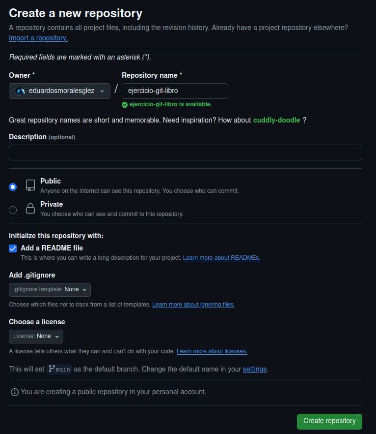
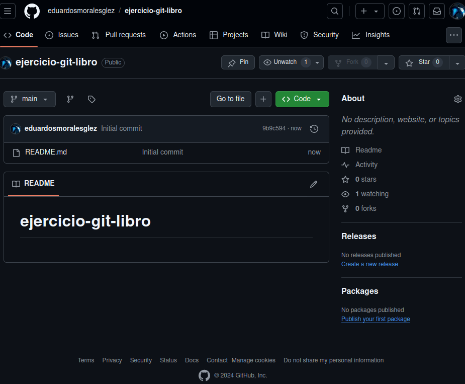

<div align="justify">

# Entornos de desarrollo.

## Comenzando con Git "Trabajando con log/branch y el HEAD en git"

### Hecho por Eduardo Serafín Morales González.

En esta tarea vamos a realizar ___distintos ejercicios___ que nos sirven de ___repaso___ de los comandos que hemos usados en anteriores tareas, y ademas, usaremos algunos __comandos nuevos__.

Para esta tarea usaremos un nuevo repositorio, por tanto, vamos a _GitHub_, iniciamos sesión y creamos un nuevo repositorio, el cual llamaremos __"ejercicio-git-libro"__





### Antes de empezar:
- Tenemos que hacer un _"git clone"_ del repositorio de esta tarea.
```code
bae2@jpexposito-VirtualBox:~/repositorios$ git clone https://github.com/eduardosmoralesglez/ejercicio-git-libro
Clonando en 'ejercicio-git-libro'...
remote: Enumerating objects: 3, done.
remote: Counting objects: 100% (3/3), done.
remote: Total 3 (delta 0), reused 0 (delta 0), pack-reused 0 (from 0)
Recibiendo objetos: 100% (3/3), listo.
bae2@jpexposito-VirtualBox:~/repositorios$ ls
ejercicio-git-branch  ejercicio-git-libro  programacion-dam  TOKEN_repo
bae2@jpexposito-VirtualBox:~/repositorios$ cd ejercicio-git-libro/
bae2@jpexposito-VirtualBox:~/repositorios/ejercicio-git-libro$ ls -la
total 16
drwxrwxr-x 3 bae2 bae2 4096 oct 14 15:57 .
drwxrwxr-x 5 bae2 bae2 4096 oct 14 15:57 ..
drwxrwxr-x 8 bae2 bae2 4096 oct 14 15:57 .git
-rw-rw-r-- 1 bae2 bae2   21 oct 14 15:57 README.md
bae2@jpexposito-VirtualBox:~/repositorios/ejercicio-git-libro$ 
```
### Ejercicio 1

- En este punto del ejercicio usaremos el comando __"git log"__ el cual mostrara los _commit's_ de nuestro repositorio pero como esta recien creado solo deberia mostrar un commit.

```code
bae2@jpexposito-VirtualBox:~/repositorios/ejercicio-git-libro$ git log 
commit 9b9c594876b60a4171375a14b690b5773e9dc169 (HEAD -> main, origin/main, origin/HEAD)
Author: Eduardo S Morales Glez <113589093+eduardosmoralesglez@users.noreply.github.com>
Date:   Mon Oct 14 15:36:13 2024 +0100

    Initial commit
bae2@jpexposito-VirtualBox:~/repositorios/ejercicio-git-libro$ git log --oneline --graph 
* 9b9c594 (HEAD -> main, origin/main, origin/HEAD) Initial commit
bae2@jpexposito-VirtualBox:~/repositorios/ejercicio-git-libro$ 

```

- Ahora empezamos con el ejercicio, tenemos que crear en nuestro repositorio un directorio el cual llamaremos ___"capitulos"___ y añadirle dentro un fichero llamado ___"capitulo1.txt"___ con el siguiente texto:
  -  `Git es un sistema de control de versiones ideado por Linus Torvalds.`

```code
bae2@jpexposito-VirtualBox:~/repositorios/ejercicio-git-libro$ pwd
/home/bae2/repositorios/ejercicio-git-libro
bae2@jpexposito-VirtualBox:~/repositorios/ejercicio-git-libro$ mkdir capitulos
bae2@jpexposito-VirtualBox:~/repositorios/ejercicio-git-libro$ cd capitulos/
bae2@jpexposito-VirtualBox:~/repositorios/ejercicio-git-libro/capitulos$ nano capitulo1.txt
bae2@jpexposito-VirtualBox:~/repositorios/ejercicio-git-libro/capitulos$ cd ..
bae2@jpexposito-VirtualBox:~/repositorios/ejercicio-git-libro$ tree
.
├── capitulos
│   └── capitulo1.txt
└── README.md

1 directory, 2 files
bae2@jpexposito-VirtualBox:~/repositorios/ejercicio-git-libro$ cat capitulos/capitulo1.txt 
Git es un sistema de control de versiones ideado por Linus Torvalds.
bae2@jpexposito-VirtualBox:~/repositorios/ejercicio-git-libro$ 
```

- Guardamos los cambios usando __git add__, hacemos un _commit_ y lo mostramos usando __git log__.
```code
bae2@jpexposito-VirtualBox:~/repositorios/ejercicio-git-libro$ git status 
En la rama main
Tu rama está actualizada con 'origin/main'.

Archivos sin seguimiento:
  (usa "git add <archivo>..." para incluirlo a lo que será confirmado)
	capitulos/

no hay nada agregado al commit pero hay archivos sin seguimiento presentes (usa "git add" para hacerles seguimiento)
bae2@jpexposito-VirtualBox:~/repositorios/ejercicio-git-libro$ git add .
bae2@jpexposito-VirtualBox:~/repositorios/ejercicio-git-libro$ git status 
En la rama main
Tu rama está actualizada con 'origin/main'.

Cambios a ser confirmados:
  (usa "git restore --staged <archivo>..." para sacar del área de stage)
	nuevos archivos: capitulos/capitulo1.txt

bae2@jpexposito-VirtualBox:~/repositorios/ejercicio-git-libro$ git commit -m "Añadido capítulo 1" 
[main c3b3b2a] Añadido capítulo 1
 1 file changed, 1 insertion(+)
 create mode 100644 capitulos/capitulo1.txt
bae2@jpexposito-VirtualBox:~/repositorios/ejercicio-git-libro$ 
bae2@jpexposito-VirtualBox:~/repositorios/ejercicio-git-libro$ git log
commit c3b3b2aa2688d00288c74753c115a51ca360cc7c (HEAD -> main)
Author: eduardosmoralesglez <eduardomoralez24@gmail.com>
Date:   Mon Oct 14 21:06:21 2024 +0100

    Añadido capítulo 1

commit 9b9c594876b60a4171375a14b690b5773e9dc169 (origin/main, origin/HEAD)
Author: Eduardo S Morales Glez <113589093+eduardosmoralesglez@users.noreply.github.com>
Date:   Mon Oct 14 15:36:13 2024 +0100

    Initial commit
bae2@jpexposito-VirtualBox:~/repositorios/ejercicio-git-libro$ 
```

### Ejercicio 2

- Ahora creamos un fichero ___"capitulo2.txt"___ y le añadimos el texto siguiente:

```
El flujo de trabajo básico con Git consiste en:
 1- Hacer cambios en el repositorio.
 2- Añadir los cambios a la zona de intercambio temporal.
 3- Hacer un commit de los cambios.
```

```code
bae2@jpexposito-VirtualBox:~/repositorios/ejercicio-git-libro$ tree
.
├── capitulos
│   └── capitulo1.txt
└── README.md

1 directory, 2 files
bae2@jpexposito-VirtualBox:~/repositorios/ejercicio-git-libro$ nano capitulos/capitulo2.txt 
bae2@jpexposito-VirtualBox:~/repositorios/ejercicio-git-libro$ tree
.
├── capitulos
│   ├── capitulo1.txt
│   └── capitulo2.txt
└── README.md

1 directory, 3 files
bae2@jpexposito-VirtualBox:~/repositorios/ejercicio-git-libro$ cat capitulos/capitulo2.txt 
El flujo de trabajo básico con Git consiste en:
 1- Hacer cambios en el repositorio.
 2- Añadir los cambios a la zona de intercambio temporal.
 3- Hacer un commit de los cambios.
bae2@jpexposito-VirtualBox:~/repositorios/ejercicio-git-libro$ 
```

-  Guardamos los cambios usando __git add__, hacemos un _commit_.

```code
bae2@jpexposito-VirtualBox:~/repositorios/ejercicio-git-libro$ git status 
En la rama main
Tu rama está adelantada a 'origin/main' por 1 commit.
  (usa "git push" para publicar tus commits locales)

Cambios a ser confirmados:
  (usa "git restore --staged <archivo>..." para sacar del área de stage)
	nuevos archivos: capitulos/capitulo2.txt

bae2@jpexposito-VirtualBox:~/repositorios/ejercicio-git-libro$ git commit -m "Añadido el capítulo 2."
[main e3f0adb] Añadido el capítulo 2.
 1 file changed, 4 insertions(+)
 create mode 100644 capitulos/capitulo2.txt
bae2@jpexposito-VirtualBox:~/repositorios/ejercicio-git-libro$ 
```

- Mostramos las diferencias de los commits que hemos hecho usando el comando __"git diff"__ y marcamos las cabezas del repositorio.

```code
bae2@jpexposito-VirtualBox:~/repositorios/ejercicio-git-libro$ git diff HEAD~2..HEAD  
diff --git a/capitulos/capitulo1.txt b/capitulos/capitulo1.txt
new file mode 100644
index 0000000..7431f9e
--- /dev/null
+++ b/capitulos/capitulo1.txt
@@ -0,0 +1 @@
+Git es un sistema de control de versiones ideado por Linus Torvalds.
diff --git a/capitulos/capitulo2.txt b/capitulos/capitulo2.txt
new file mode 100644
index 0000000..4abf557
--- /dev/null
+++ b/capitulos/capitulo2.txt
@@ -0,0 +1,4 @@
+El flujo de trabajo básico con Git consiste en:
+ 1- Hacer cambios en el repositorio.
+ 2- Añadir los cambios a la zona de intercambio temporal.
+ 3- Hacer un commit de los cambios.
bae2@jpexposito-VirtualBox:~/repositorios/ejercicio-git-libro$ 
```

### Ejercicio 3

- Creamos otro capitulo __"capitulo3.txt"__

```code
bae2@jpexposito-VirtualBox:~/repositorios/ejercicio-git-libro$ tree
.
├── capitulos
│   ├── capitulo1.txt
│   └── capitulo2.txt
└── README.md

1 directory, 3 files
bae2@jpexposito-VirtualBox:~/repositorios/ejercicio-git-libro$ nano capitulos/capitulo3.txt
bae2@jpexposito-VirtualBox:~/repositorios/ejercicio-git-libro$ tree
.
├── capitulos
│   ├── capitulo1.txt
│   ├── capitulo2.txt
│   └── capitulo3.txt
└── README.md

1 directory, 4 files
bae2@jpexposito-VirtualBox:~/repositorios/ejercicio-git-libro$ cat capitulos/capitulo3.txt 
Git permite la creación de ramas lo que permite tener distintas versiones del mismo proyecto y trabajar de manera simultanea en ellas.
```

- Guardamos el cambio usando _git add_ y creamos un _commit_, ademas de mostrar los cambios en los commit's.

```code
bae2@jpexposito-VirtualBox:~/repositorios/ejercicio-git-libro$ git status 
En la rama main
Tu rama está adelantada a 'origin/main' por 2 commits.
  (usa "git push" para publicar tus commits locales)

Archivos sin seguimiento:
  (usa "git add <archivo>..." para incluirlo a lo que será confirmado)
	capitulos/capitulo3.txt

no hay nada agregado al commit pero hay archivos sin seguimiento presentes (usa "git add" para hacerles seguimiento)
bae2@jpexposito-VirtualBox:~/repositorios/ejercicio-git-libro$ git add .
bae2@jpexposito-VirtualBox:~/repositorios/ejercicio-git-libro$ git commit -m "Añadido el capítulo 3"
[main 2e1a61d] Añadido el capítulo 3
 1 file changed, 1 insertion(+)
 create mode 100644 capitulos/capitulo3.txt
bae2@jpexposito-VirtualBox:~/repositorios/ejercicio-git-libro$ git log 
commit 2e1a61da780da526c4c254b62bca30157e4c8213 (HEAD -> main)
Author: eduardosmoralesglez <eduardomoralez24@gmail.com>
Date:   Mon Oct 14 21:39:06 2024 +0100

    Añadido el capítulo 3

commit e3f0adb4888c572eebf0c1e8dc5d332e0c6c6014
Author: eduardosmoralesglez <eduardomoralez24@gmail.com>
Date:   Mon Oct 14 21:21:19 2024 +0100

    Añadido el capítulo 2.

commit c3b3b2aa2688d00288c74753c115a51ca360cc7c
Author: eduardosmoralesglez <eduardomoralez24@gmail.com>
Date:   Mon Oct 14 21:06:21 2024 +0100

    Añadido capítulo 1

commit 9b9c594876b60a4171375a14b690b5773e9dc169 (origin/main, origin/HEAD)
Author: Eduardo S Morales Glez <113589093+eduardosmoralesglez@users.noreply.github.com>
Date:   Mon Oct 14 15:36:13 2024 +0100

    Initial commit
bae2@jpexposito-VirtualBox:~/repositorios/ejercicio-git-libro$ 
```

- Ahora usamos el comando _git diff_ con el codigo hash de la primera version y la cabeza actual.

```code
bae2@jpexposito-VirtualBox:~/repositorios/ejercicio-git-libro$ git diff 9b9c594876b60a4171375a14b690b5773e9dc169..HEAD 
diff --git a/capitulos/capitulo1.txt b/capitulos/capitulo1.txt
new file mode 100644
index 0000000..7431f9e
--- /dev/null
+++ b/capitulos/capitulo1.txt
@@ -0,0 +1 @@
+Git es un sistema de control de versiones ideado por Linus Torvalds.
diff --git a/capitulos/capitulo2.txt b/capitulos/capitulo2.txt
new file mode 100644
index 0000000..4abf557
--- /dev/null
+++ b/capitulos/capitulo2.txt
@@ -0,0 +1,4 @@
+El flujo de trabajo básico con Git consiste en:
+ 1- Hacer cambios en el repositorio.
+ 2- Añadir los cambios a la zona de intercambio temporal.
+ 3- Hacer un commit de los cambios.
diff --git a/capitulos/capitulo3.txt b/capitulos/capitulo3.txt
new file mode 100644
index 0000000..6e501ab
--- /dev/null
+++ b/capitulos/capitulo3.txt
@@ -0,0 +1 @@
+Git permite la creación de ramas lo que permite tener distintas versiones del mismo proyecto y trabajar de manera simultanea en ellas.
bae2@jpexposito-VirtualBox:~/repositorios/ejercicio-git-libro$ 
```

### Ejercicio 4

- Creamos un fichero __"indice.txt"__ y le añadimos el texto:

`Indice de los cápitulos, con conceptos avanzados de git`

```code
bae2@jpexposito-VirtualBox:~/repositorios/ejercicio-git-libro/capitulos$ nano indice.txt
bae2@jpexposito-VirtualBox:~/repositorios/ejercicio-git-libro/capitulos$ tree
.
├── capitulo1.txt
├── capitulo2.txt
├── capitulo3.txt
└── indice.txt

0 directories, 4 files
bae2@jpexposito-VirtualBox:~/repositorios/ejercicio-git-libro/capitulos$ cat indice.txt 
Indice de los cápitulos, con conceptos avanzados de git
bae2@jpexposito-VirtualBox:~/repositorios/ejercicio-git-libro/capitulos$ 
```

- Guardamos con _git add_ y hacemos un commit.

```code
bae2@jpexposito-VirtualBox:~/repositorios/ejercicio-git-libro/capitulos$ git status 
En la rama main
Tu rama está adelantada a 'origin/main' por 3 commits.
  (usa "git push" para publicar tus commits locales)

Archivos sin seguimiento:
  (usa "git add <archivo>..." para incluirlo a lo que será confirmado)
	indice.txt

no hay nada agregado al commit pero hay archivos sin seguimiento presentes (usa "git add" para hacerles seguimiento)
bae2@jpexposito-VirtualBox:~/repositorios/ejercicio-git-libro/capitulos$ git add .
bae2@jpexposito-VirtualBox:~/repositorios/ejercicio-git-libro/capitulos$ git status 
En la rama main
Tu rama está adelantada a 'origin/main' por 3 commits.
  (usa "git push" para publicar tus commits locales)

Cambios a ser confirmados:
  (usa "git restore --staged <archivo>..." para sacar del área de stage)
	nuevos archivos: indice.txt

bae2@jpexposito-VirtualBox:~/repositorios/ejercicio-git-libro/capitulos$ git commit -m "Se crea el Indice."
[main 1cca348] Se crea el Indice.
 1 file changed, 1 insertion(+)
 create mode 100644 capitulos/indice.txt
bae2@jpexposito-VirtualBox:~/repositorios/ejercicio-git-libro/capitulos$ 
```

- Usamos el comando ___"git annotate"___ del indice que acabamos de crear.

```code
bae2@jpexposito-VirtualBox:~/repositorios/ejercicio-git-libro/capitulos$ git annotate indice.txt
1cca348c        (eduardosmoralesglez    2024-10-14 23:30:26 +0100       1)Indice de los cápitulos, con conceptos avanzados de git
bae2@jpexposito-VirtualBox:~/repositorios/ejercicio-git-libro/capitulos$ 
```

### Ejercicio 5

- Ahora creamos una nueva rama, la llamaremos __"bibliografia"__.

```code
bae2@jpexposito-VirtualBox:~/repositorios/ejercicio-git-libro/capitulos$ git branch bibliografia
bae2@jpexposito-VirtualBox:~/repositorios/ejercicio-git-libro/capitulos$ 
bae2@jpexposito-VirtualBox:~/repositorios/ejercicio-git-libro/capitulos$ git branch -av
  bibliografia        1cca348 Se crea el Indice.
* main                1cca348 [adelante 4] Se crea el Indice.
  remotes/origin/HEAD -> origin/main
  remotes/origin/main 9b9c594 Initial commit
bae2@jpexposito-VirtualBox:~/repositorios/ejercicio-git-libro/capitulos$ 
```

### Ejercicio 6

- Creamos otro fichero __"capitulo4.txt"__ y le añadimos el texto:
`En este capítulo veremos cómo usar GitHub para alojar repositorios en remoto.`

```code
bae2@jpexposito-VirtualBox:~/repositorios/ejercicio-git-libro/capitulos$ nano capitulo4.txt
bae2@jpexposito-VirtualBox:~/repositorios/ejercicio-git-libro/capitulos$ tree
.
├── capitulo1.txt
├── capitulo2.txt
├── capitulo3.txt
├── capitulo4.txt
└── indice.txt

0 directories, 5 files
bae2@jpexposito-VirtualBox:~/repositorios/ejercicio-git-libro/capitulos$ cat capitulo4.txt 
En este capítulo veremos cómo usar GitHub para alojar repositorios en remoto.
bae2@jpexposito-VirtualBox:~/repositorios/ejercicio-git-libro/capitulos$ 
```

- Guardamos el cambio usando _git add_ y creamos un _commit_, ademas de mostrar los cambios en los commit's usando _git log_.

```code
bae2@jpexposito-VirtualBox:~/repositorios/ejercicio-git-libro/capitulos$ git add .
bae2@jpexposito-VirtualBox:~/repositorios/ejercicio-git-libro/capitulos$ git status 
En la rama main
Tu rama está adelantada a 'origin/main' por 4 commits.
  (usa "git push" para publicar tus commits locales)

Cambios a ser confirmados:
  (usa "git restore --staged <archivo>..." para sacar del área de stage)
	nuevos archivos: capitulo4.txt

bae2@jpexposito-VirtualBox:~/repositorios/ejercicio-git-libro/capitulos$ git commit -m "Añadido el capitulo 4"
[main 9b5a967] Añadido el capitulo 4
 1 file changed, 1 insertion(+)
 create mode 100644 capitulos/capitulo4.txt
bae2@jpexposito-VirtualBox:~/repositorios/ejercicio-git-libro/capitulos$ git log --graph --all --oneline 
* 9b5a967 (HEAD -> main) Añadido el capitulo 4
* 1cca348 (bibliografia) Se crea el Indice.
* 2e1a61d Añadido el capítulo 3
* e3f0adb Añadido el capítulo 2.
* c3b3b2a Añadido capítulo 1
* 9b9c594 (origin/main, origin/HEAD) Initial commit
bae2@jpexposito-VirtualBox:~/repositorios/ejercicio-git-libro/capitulos$ 
```

### Ejercicio 7

- Cambiamos a la rama Bibligrafia y creamos un fichero ___"bibliografia.txt"___ con el contenido:
`Chacon, S. and Straub, B. Pro Git. Apress.`

```code
bae2@jpexposito-VirtualBox:~/repositorios/ejercicio-git-libro/capitulos$ git checkout bibliografia 
Cambiado a rama 'bibliografia'
bae2@jpexposito-VirtualBox:~/repositorios/ejercicio-git-libro/capitulos$ nano bibliografia.txt
bae2@jpexposito-VirtualBox:~/repositorios/ejercicio-git-libro/capitulos$ tree
.
├── bibliografia.txt
├── capitulo1.txt
├── capitulo2.txt
├── capitulo3.txt
└── indice.txt

0 directories, 5 files
bae2@jpexposito-VirtualBox:~/repositorios/ejercicio-git-libro/capitulos$ cat bibliografia.txt 
Chacon, S. and Straub, B. Pro Git. Apress.
bae2@jpexposito-VirtualBox:~/repositorios/ejercicio-git-libro/capitulos$ 
```

- Guardamos con _git add_ y hacemos un commit.

```code
bae2@jpexposito-VirtualBox:~/repositorios/ejercicio-git-libro/capitulos$ git status 
En la rama bibliografia
Archivos sin seguimiento:
  (usa "git add <archivo>..." para incluirlo a lo que será confirmado)
	bibliografia.txt

no hay nada agregado al commit pero hay archivos sin seguimiento presentes (usa "git add" para hacerles seguimiento)
bae2@jpexposito-VirtualBox:~/repositorios/ejercicio-git-libro/capitulos$ git add .
bae2@jpexposito-VirtualBox:~/repositorios/ejercicio-git-libro/capitulos$ git status 
En la rama bibliografia
Cambios a ser confirmados:
  (usa "git restore --staged <archivo>..." para sacar del área de stage)
	nuevos archivos: bibliografia.txt

bae2@jpexposito-VirtualBox:~/repositorios/ejercicio-git-libro/capitulos$ git commit -m "Añadida primera referencia bibliografica"
[bibliografia 109335a] Añadida primera referencia bibliografica
 1 file changed, 1 insertion(+)
 create mode 100644 capitulos/bibliografia.txt
bae2@jpexposito-VirtualBox:~/repositorios/ejercicio-git-libro/capitulos$ 
```

- Mostramos el historial de commit's usando __"git log"__

```code
bae2@jpexposito-VirtualBox:~/repositorios/ejercicio-git-libro/capitulos$ git log --graph --all --oneline 
* 109335a (HEAD -> bibliografia) Añadida primera referencia bibliografica
| * 9b5a967 (main) Añadido el capitulo 4
|/  
* 1cca348 Se crea el Indice.
* 2e1a61d Añadido el capítulo 3
* e3f0adb Añadido el capítulo 2.
* c3b3b2a Añadido capítulo 1
* 9b9c594 (origin/main, origin/HEAD) Initial commit
bae2@jpexposito-VirtualBox:~/repositorios/ejercicio-git-libro/capitulos$ 
```

### Ejercicio 8

- Fusionamos la rama biblioteca con la rama main.

```code
bae2@jpexposito-VirtualBox:~/repositorios/ejercicio-git-libro/capitulos$ git checkout main 
Cambiado a rama 'main'
Tu rama está adelantada a 'origin/main' por 5 commits.
  (usa "git push" para publicar tus commits locales)
bae2@jpexposito-VirtualBox:~/repositorios/ejercicio-git-libro/capitulos$ 
bae2@jpexposito-VirtualBox:~/repositorios/ejercicio-git-libro/capitulos$ git merge bibliografia 
Merge made by the 'ort' strategy.
 capitulos/bibliografia.txt | 1 +
 1 file changed, 1 insertion(+)
 create mode 100644 capitulos/bibliografia.txt
bae2@jpexposito-VirtualBox:~/repositorios/ejercicio-git-libro/capitulos$ 

```

- Mostramos el historial de todo el repositorio usando __"git log --graph --all --oneline"__

```code
bae2@jpexposito-VirtualBox:~/repositorios/ejercicio-git-libro/capitulos$ git log --graph --all --oneline 
*   4f72cff (HEAD -> main) Merge branch 'bibliografia' Fusion de rama bibliografia a main
|\  
| * 109335a (bibliografia) Añadida primera referencia bibliografica
* | 9b5a967 Añadido el capitulo 4
|/  
* 1cca348 Se crea el Indice.
* 2e1a61d Añadido el capítulo 3
* e3f0adb Añadido el capítulo 2.
* c3b3b2a Añadido capítulo 1
* 9b9c594 (origin/main, origin/HEAD) Initial commit
bae2@jpexposito-VirtualBox:~/repositorios/ejercicio-git-libro/capitulos$ 
```

- Eliminamos la rama biblioteca usando ___"git branch -d"___

```code
bae2@jpexposito-VirtualBox:~/repositorios/ejercicio-git-libro/capitulos$ git branch -d bibliografia
Eliminada la rama bibliografia (era 109335a).
bae2@jpexposito-VirtualBox:~/repositorios/ejercicio-git-libro/capitulos$ 
```

- Y volvemos a mostrar el historial de todo el repositorio

```code
bae2@jpexposito-VirtualBox:~/repositorios/ejercicio-git-libro/capitulos$ git log --graph --all --oneline 
*   4f72cff (HEAD -> main) Merge branch 'bibliografia' Fusion de rama bibliografia a main
|\  
| * 109335a Añadida primera referencia bibliografica
* | 9b5a967 Añadido el capitulo 4
|/  
* 1cca348 Se crea el Indice.
* 2e1a61d Añadido el capítulo 3
* e3f0adb Añadido el capítulo 2.
* c3b3b2a Añadido capítulo 1
* 9b9c594 (origin/main, origin/HEAD) Initial commit
bae2@jpexposito-VirtualBox:~/repositorios/ejercicio-git-libro/capitulos$ 
```

### Ejercicio 9

- Creamos nuevamente la rama bibliografia y modificamos el fichero _"bibliografia.txt"_ y añadimos lo siguiente:

`Scott Chacon and Ben Straub. Pro Git. Apress.
Ryan Hodson. Ry’s Git Tutorial. Smashwords (2014)`

```code
bae2@jpexposito-VirtualBox:~/repositorios/ejercicio-git-libro/capitulos$ git branch bibliografia
bae2@jpexposito-VirtualBox:~/repositorios/ejercicio-git-libro/capitulos$ git checkout bibliografia 
Cambiado a rama 'bibliografia'
bae2@jpexposito-VirtualBox:~/repositorios/ejercicio-git-libro/capitulos$ nano bibliografia.txt 
bae2@jpexposito-VirtualBox:~/repositorios/ejercicio-git-libro/capitulos$ tree
.
├── bibliografia.txt
├── capitulo1.txt
├── capitulo2.txt
├── capitulo3.txt
├── capitulo4.txt
└── indice.txt

0 directories, 6 files
bae2@jpexposito-VirtualBox:~/repositorios/ejercicio-git-libro/capitulos$ cat bibliografia.txt 
Scott Chacon and Ben Straub. Pro Git. Apress.
Ryan Hodson. Ry’s Git Tutorial. Smashwords (2014)
bae2@jpexposito-VirtualBox:~/repositorios/ejercicio-git-libro/capitulos$ 
bae2@jpexposito-VirtualBox:~/repositorios/ejercicio-git-libro/capitulos$ git status 
En la rama bibliografia
Cambios no rastreados para el commit:
  (usa "git add <archivo>..." para actualizar lo que será confirmado)
  (usa "git restore <archivo>..." para descartar los cambios en el directorio de trabajo)
	modificados:     bibliografia.txt

sin cambios agregados al commit (usa "git add" y/o "git commit -a")
bae2@jpexposito-VirtualBox:~/repositorios/ejercicio-git-libro/capitulos$ git add .
bae2@jpexposito-VirtualBox:~/repositorios/ejercicio-git-libro/capitulos$ git commit -m "Añadida nuevas referencias bibliograficas"
[bibliografia efc94fb] Añadida nuevas referencias bibliograficas
 1 file changed, 2 insertions(+), 1 deletion(-)
bae2@jpexposito-VirtualBox:~/repositorios/ejercicio-git-libro/capitulos$ 
```

- Cambiamos a la rama main y volvemos a modificar el fichero __"biblioteca.txt"__ y  añadimos lo siguiente:

`Chacon, S. and Straub, B. Pro Git. Apress.
Loeliger, J. and McCullough, M. Version control with Git. O’Reilly.`

```code
bae2@jpexposito-VirtualBox:~/repositorios/ejercicio-git-libro/capitulos$ git checkout main
Cambiado a rama 'main'
Tu rama está adelantada a 'origin/main' por 7 commits.
  (usa "git push" para publicar tus commits locales)
bae2@jpexposito-VirtualBox:~/repositorios/ejercicio-git-libro/capitulos$ nano bibliografia.txt 
bae2@jpexposito-VirtualBox:~/repositorios/ejercicio-git-libro/capitulos$ tree
.
├── bibliografia.txt
├── capitulo1.txt
├── capitulo2.txt
├── capitulo3.txt
├── capitulo4.txt
└── indice.txt

0 directories, 6 files
bae2@jpexposito-VirtualBox:~/repositorios/ejercicio-git-libro/capitulos$ cat bibliografia.txt 
Chacon, S. and Straub, B. Pro Git. Apress.
Loeliger, J. and McCullough, M. Version control with Git. O’Reilly.
Hodson, R. Ry’s Git Tutorial. Smashwords (2014)
bae2@jpexposito-VirtualBox:~/repositorios/ejercicio-git-libro/capitulos$ 
```

- Guardamos con _git add_ y hacemos un commit.

```code
bae2@jpexposito-VirtualBox:~/repositorios/ejercicio-git-libro/capitulos$ git add .
bae2@jpexposito-VirtualBox:~/repositorios/ejercicio-git-libro/capitulos$ git commit -m "Añadidas nuevas referencias bibliográfica"
[main 8eac503] Añadidas nuevas referencias bibliográfica
 1 file changed, 2 insertions(+)
```

- Fusionamos la rama bibligrafia con la rama main y resolvemos el conflicto de _"bibliografia.txt"_ usando lo siguiente:

`Chacon, S. and Straub, B. Pro Git. Apress.
Loeliger, J. and McCullough, M. Version control with Git. O’Reilly.
Hodson, R. Ry’s Git Tutorial. Smashwords (2014)`

```code
bae2@jpexposito-VirtualBox:~/repositorios/ejercicio-git-libro/capitulos$ git merge bibliografia 
Auto-fusionando capitulos/bibliografia.txt
CONFLICTO (contenido): Conflicto de fusión en capitulos/bibliografia.txt
Fusión automática falló; arregle los conflictos y luego realice un commit con el resultado.
bae2@jpexposito-VirtualBox:~/repositorios/ejercicio-git-libro/capitulos$ 
bae2@jpexposito-VirtualBox:~/repositorios/ejercicio-git-libro/capitulos$ nano bibliografia.txt 
bae2@jpexposito-VirtualBox:~/repositorios/ejercicio-git-libro/capitulos$ tree
.
├── bibliografia.txt
├── capitulo1.txt
├── capitulo2.txt
├── capitulo3.txt
├── capitulo4.txt
└── indice.txt

0 directories, 6 files
bae2@jpexposito-VirtualBox:~/repositorios/ejercicio-git-libro/capitulos$ cat bibliografia.txt 
Chacon, S. and Straub, B. Pro Git. Apress.
Loeliger, J. and McCullough, M. Version control with Git. O’Reilly.
Hodson, R. Ry’s Git Tutorial. Smashwords (2014)
bae2@jpexposito-VirtualBox:~/repositorios/ejercicio-git-libro/capitulos$ 
```

- Guardamos con _git add_ y hacemos un commit y mostramos el historial usando _"git log"_.

```code
bae2@jpexposito-VirtualBox:~/repositorios/ejercicio-git-libro/capitulos$ git add .
bae2@jpexposito-VirtualBox:~/repositorios/ejercicio-git-libro/capitulos$ git commit -m "Solucionado conflicto bibliografía"
[main 554959f] Solucionado conflicto bibliografía
bae2@jpexposito-VirtualBox:~/repositorios/ejercicio-git-libro/capitulos$ 
bae2@jpexposito-VirtualBox:~/repositorios/ejercicio-git-libro/capitulos$ git log --graph --all --oneline 
*   554959f (HEAD -> main) Solucionado conflicto bibliografía
|\  
| * efc94fb (bibliografia) Añadida nuevas referencias bibliograficas
* | 8eac503 Añadidas nuevas referencias bibliográfica
|/  
*   4f72cff Merge branch 'bibliografia' Fusion de rama bibliografia a main
|\  
| * 109335a Añadida primera referencia bibliografica
* | 9b5a967 Añadido el capitulo 4
|/  
* 1cca348 Se crea el Indice.
* 2e1a61d Añadido el capítulo 3
* e3f0adb Añadido el capítulo 2.
* c3b3b2a Añadido capítulo 1
* 9b9c594 (origin/main, origin/HEAD) Initial commit
bae2@jpexposito-VirtualBox:~/repositorios/ejercicio-git-libro/capitulos$ 
```

Finalizando la tarea.